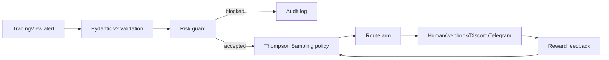
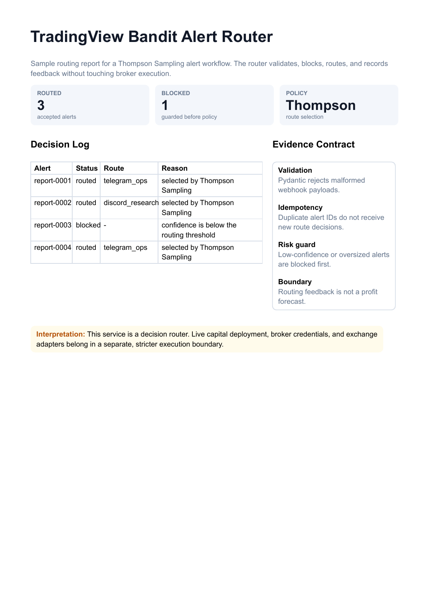

# TradingView Bandit Alert Router

TradingView webhook router with typed validation, risk guards, idempotency, Thompson Sampling route selection, Litestar endpoints, and reward feedback.

This is not a trading bot and it does not promise profit. It is a routing layer for deciding where an alert should go next: paper-trade webhook, human review, research channel, or blocked.



## Why It Exists

Most TradingView automation jumps from alert to execution too quickly. This repo treats alerts as decisions that need validation, risk limits, idempotency, and feedback.

## Features

- TradingView webhook payload validation with Pydantic v2
- Symbol, confidence, and max-risk guards
- Idempotency by `alert_id`
- Thompson Sampling across route arms
- Reward endpoint for closed-loop learning
- Litestar endpoints and CLI replay demo
- Ruff + pytest + coverage-ready project layout

## Sample Output



- [PDF report](docs/samples/bandit_alert_router_report.pdf)
- [Sample alert stream](examples/sample_alerts.jsonl)

## Quickstart

```bash
python -m venv .venv
.venv\Scripts\activate
pip install -e ".[dev]"
python -m pytest
python -m ruff check .
tv-bandit-demo replay
```

Run the API:

```bash
uvicorn tradingview_bandit_router.app:app --reload
```

## Example Alert

```json
{
  "alert_id": "alert-0001",
  "strategy": "breakout_v1",
  "symbol": "BTCUSDT",
  "timeframe": "15m",
  "side": "long",
  "confidence": 0.72,
  "price": 64000,
  "risk_usd": 250,
  "features": {"atr_pct": 0.02, "volume_z": 1.8}
}
```

## API

| Endpoint | Purpose |
|---|---|
| `POST /v1/alerts` | Validate and route a TradingView alert |
| `POST /v1/rewards` | Update the selected route arm after outcome feedback |
| `GET /v1/arms` | Inspect posterior route quality |
| `GET /health` | Health check |

## Scope

This router is intentionally the decision layer. Broker execution, credential storage, exchange adapters, and live capital deployment should be separate systems with stricter controls.

## Evidence Contract

- Pydantic validates every TradingView payload before routing.
- Idempotency prevents duplicate alerts from receiving multiple policy decisions.
- Risk guards run before Thompson Sampling so blocked alerts never enter routing arms.
- Reward feedback updates route quality; it does not imply future trading performance.
